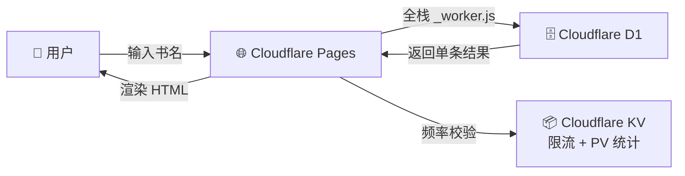

# 📚 小说快搜 (Novel Search)

<p align="center">
  
  
  
  
</p>

> 🚀  全栈 Serverless · 国内直连 · （尊重近期官方的xx行动选择，等官方开放后本项目会全面开源，顺手点个星吧）

一个因为贴吧用户求助打造的**极简小说搜索引擎**。用户输入书名关键词，秒级返回书籍详情页链接。在公开库中留此文档另做分享与记录。

🔗 **在线访问：** * https://novel-search-serverless.pages.dev/ *


---

## ✨ 核心特性

| 特性 | 说明 |
|------|------|
| ⚡ **边缘计算加速** | 基于 Cloudflare 全球边缘网络，国内直连 `.pages.dev` 域名，毫秒级响应 |
| 🛡️ **智能频率控制** | 自研 IP 级别滑动窗口限流算法，恶意刷量自动返回 429 |
| 📊 **简要显示** | 页面浏览量与搜索次数可见，数据存于 KV |
| 💰 **架构** | Cloudflare Pages + D1 + KV  |

---

## 🛠 技术架构



| 层 | 技术 |
|----|------|
| 🎨 **前端** | 原生 HTML/CSS/JS，Bootstrap 5 响应式，内嵌 Worker 同构直出 |
| ⚙️ **后端** | Cloudflare Pages Functions (`_worker.js`)，单文件全栈路由分发 |
| 🗄️ **数据库** | Cloudflare D1（SQLite 兼容），参数化查询防 SQL 注入 |
| 📦 **缓存 & 限流** | Cloudflare KV + 内存 LRU Cache，双重加速 |
| 🚀 **部署** | Git Push → Cloudflare Pages 自动 CI/CD，零停机 |

---

## 🔧 技能栈展示

| 环节 | 涉及能力 |
|------|----------|
| **数据工程** | 数据清处理，迁移上云 |
| **后端开发** | Cloudflare Workers / Pages Functions，RESTful API 设计，路由分发，CORS 处理 |
| **数据库** | D1 (SQLite) 建表、索引优化、参数化查询防注入 |
| **安全防护** | KV 实现滑动窗口限流算法、IP 级别访问控制 |
| **前端工程** | 原生 JS 异步请求、DOM 操作、Bootstrap UI、统计实时刷新 |
| **DevOps** | Git + Cloudflare Pages CI/CD，零停机自动部署 |

---

## 📂 仓库说明

> ⚠️ **本仓库仅包含网站入口代码与架构文档。** 各种敏感资料和开发中私人令牌等均让ai自己判断清洗了一遍**暂时不在此仓库中**。

```
novel-search-serverless/
├── public/
│   └── _worker.js          # Cloudflare  全栈入口
├── .gitignore               # 数据策略
├── wrangler.toml.example    # 部署配置
└── README.md
```

---


<p align="center">
  <sub>Built with ❤️ by YL Z · Powered by Cloudflare Pages</sub>
</p>


